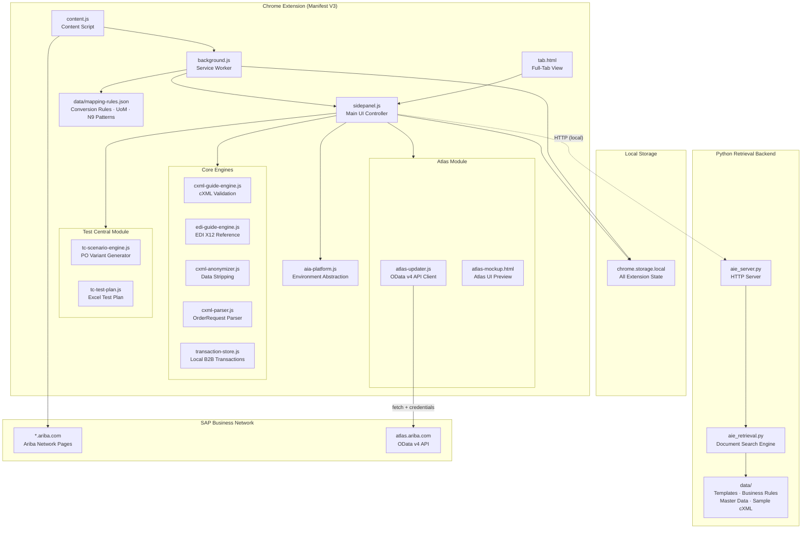

# Ariba Integration Agent — SAP Business Network Integration Assistant

Ariba Integration Agent (AIA) is a Chrome Extension (Manifest V3, v4.1.1) that accelerates supplier onboarding and EDI/cXML integration on the SAP Business Network. It provides an intelligent side panel that guides integration consultants and suppliers through the complete B2B connectivity setup — from initial onboarding stage tracking through field mapping validation, test plan generation, Atlas field updates, and Integration Guide Workbook (IGW) creation. The extension injects directly into Ariba Network pages, detecting context (supplier ANID, portal section) and surfacing relevant guidance automatically.

The agent operates with a local-first architecture: all business rules, mapping logic, and AI knowledge base run within the extension without external API calls. It supports EDI X12 ↔ cXML bidirectional field mapping across all major transaction types (850/855/856/810/820), automated error detection on Ariba UI5 pages, supplier readiness scoring, Test Central scenario generation, Atlas OData integration, and Excel-based IGW generation. A Python retrieval backend provides enhanced document search across integration templates, business rules, and master data.

## Features & Modules

| Module | Description |
|--------|-------------|
| **Supplier Onboarding Pipeline** | 6-stage tracking (Discovery → Config → Mapping → Testing → Go-Live → Monitoring) |
| **EDI ↔ cXML Mapping Engine** | Bidirectional field mapping for X12 850/855/856/810/820 transactions |
| **cXML Guide Engine** | Parse and validate cXML documents against Ariba schemas |
| **cXML Parser** | Standalone OrderRequest parser — extracts header, line items, addresses, totals |
| **EDI Guide Engine** | EDI X12 segment/element reference and validation |
| **cXML Anonymizer** | Strip sensitive data from cXML documents for sharing/debugging |
| **Transaction Store** | Local B2B transaction storage and replay |
| **Error Detection** | Auto-scan Ariba SAP UI5 DOM for integration errors with fix suggestions |
| **Test Central — Scenario Engine** | Generate PO variant cXML scenarios (Multi-Line Split, No SupplierPartID, Ad-hoc Ship-To) |
| **Test Central — Test Plan Generator** | Excel test plan generation (OC/ASN/INV/Credit Memo) via xlsx-js-style |
| **IGW Generator** | Integration Guide Workbook (Excel) generation with full field mapping details |
| **Atlas Updater** | OData v4 API integration with atlas.ariba.com — update SI/BRP fields programmatically |
| **Readiness Scoring** | Rule-based supplier integration readiness assessment |
| **AI Knowledge Base** | Local rule-based Q&A for Ariba integration guidance |
| **Context Detection** | 6-strategy ANID/org detection from Ariba Network pages |
| **Retrieval Backend** | Python server for document search (templates, business rules, master data) |
| **Tab/Panel Modes** | Side panel + full-tab view for wider workspace |

## Architecture



## File Structure

```
background.js              ← Service worker: message router, AI KB, IGW/test plan generation
content.js                 ← Injected into *.ariba.com: FAB, context detection, error scan
sidepanel.js               ← Main UI controller: nav, tabs, all panel logic
sidepanel.html             ← Side panel shell
tab.html / index.html      ← Full-tab workspace view
aia-platform.js            ← Environment abstraction (extension vs web app)
cxml-guide-engine.js       ← cXML document parsing and validation
edi-guide-engine.js        ← EDI X12 segment reference
cxml-parser.js             ← Standalone cXML OrderRequest parser
cxml-anonymizer.js         ← Sensitive data stripping
tc-scenario-engine.js      ← Test Central PO variant generator (3 scenarios)
tc-test-plan.js            ← Test Central Excel test plan (OC/ASN/INV/Credit Memo)
atlas-updater.js           ← Atlas OData v4 API — SI/BRP field updates
atlas-mockup.html          ← Atlas UI workflow mockup
build-ext.sh               ← Extension build and packaging script
data/mapping-rules.json    ← Deterministic EDI↔cXML conversion rules, UoM, N9 patterns
aie-backend/
  ├── aie_server.py        ← Python retrieval server
  ├── aie_retrieval.py     ← Document search engine
  └── data/               ← Templates, business rules, master data, sample cXML
```

## Tech Stack

- Chrome Extension Manifest V3 (no bundler, IIFE module pattern)
- Vanilla JavaScript
- Python 3 (retrieval backend)
- SheetJS / xlsx-js-style (Excel generation for IGW and test plans)
- JSZip (archive handling)
- chrome.storage.local (all extension state)
- Chrome Side Panel API
- Fetch + OData v4 (Atlas integration)

## Installation

1. Clone or download the repository
2. Open Chrome → `chrome://extensions/` → Enable **Developer mode**
3. Click **Load unpacked** → select this folder
4. Navigate to any `*.ariba.com` page and open the side panel (`⌘+Shift+A` / `Ctrl+Shift+A`)

### Optional: Python Retrieval Backend

```bash
cd aie-backend
pip install -r requirements.txt
python aie_server.py
```

The backend runs on `http://localhost:8765` and enhances document search within the extension.

## Test Central Integration

The **Test Central** module generates SAP Business Network test scenarios from a real cXML PO:

| Scenario | Description |
|----------|-------------|
| Multi-Line Split | First ItemOut split into 3 equal lines — tests multi-line PO handling |
| No SupplierPartID | All SupplierPartID elements removed — buyer-only catalog reference |
| Ad-hoc Ship-To | Ship-To name prefixed `ADBUYER-` — non-standard delivery address |

Test plans are exported as Excel workbooks with OC / ASN / INV / Credit Memo columns per scenario.

## Atlas Integration

`atlas-updater.js` connects to `atlas.ariba.com` via OData v4 to update Supplier Integration (SI) and Buyer Regional Playbook (BRP) records directly from the extension, without manual Atlas UI navigation.
